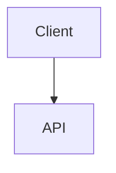

# Лабораторные работы по системному проектированию

Этот репозиторий используется для выполнения лабораторных работ (ЛР), а так же итогового курсового проекта.

# 📦 Структура репозитория

    assets/           # изображения (png/svg/jpg)
    lab-n/            # каталоги для выполнения соответствующих ЛР
    architecture.md   # документ с курсовым проектом, который вы сможете оформить после выполнения всех ЛР

Дополнительные файлы допускаются только при обоснованной необходимости.

# 📄 Требования к оформлению

## 1. Формат

-   Используется **Markdown**.
-   Поддерживаемый диалект - [GitHub Flavored Markdown (GFM)](https://docs.github.com/ru/get-started/writing-on-github/getting-started-with-writing-and-formatting-on-github/basic-writing-and-formatting-syntax).
-   Документ должен корректно отображаться в веб-интерфейсе GitHub.
-   В репозитории хранится только текст и связанные с ним ресурсы.

## 2. Диаграммы

-   Основной формат диаграмм - [Mermaid](https://mermaid.js.org/intro/).
-   Диаграммы вставляются непосредственно в `lab-n.md`.

Пример:

    ``` mermaid
    graph TD
        A[Client] --> B[API]
    ```

Результат:



Требования:

-   Диаграммы должны корректно рендериться в GitHub.
-   Диаграммы должны быть читаемыми.

## 3. Изображения

Если необходимо вставить изображение:

-   Файл размещается в каталоге `assets/`.
-   Используется относительная ссылка.

Пример:

    


## 4. Ссылки

-   **Запрещены ссылки на внешние ресурсы.**
-   Вся необходимая информация должна находиться внутри репозитория.
-   Допускаются только относительные ссылки на файлы внутри проекта.

Документ с ЛР должен быть полностью самодостаточным.

# 🔀 Правила работы с Git

## 1. Основная ветка

-   Прямые push в `main` запрещены.
-   Работа ведётся только через Pull Request.

## 2. Правило «один PR - одна лабораторная»

Каждая ЛР:

-   выполняется в отдельной ветке (`lab-1`, `lab-2`, ...);
-   оформляется отдельным Pull Request;
-   не объединяется с другими лабораторными.

## 3. Merge после проверки

После получения approval:

-   Pull Request обязательно мёржится в `main`;
-   следующая лабораторная начинается от актуального `main`.

# 🌟 Курсовой проект

По итогам выполнения всех шести ЛР у вас будет возможность объеденить их в **единый архитектурный документ** в файле `architecture.md`. Курсовой проект оценивается отдельно и имеет свою разбалловку.
